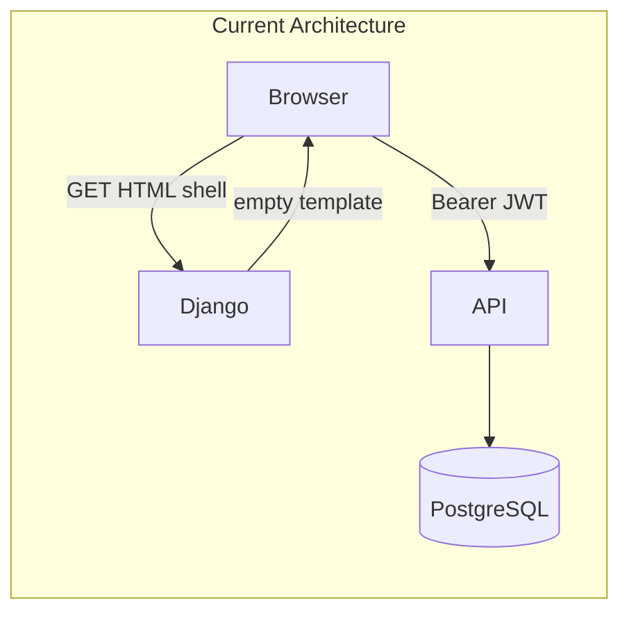
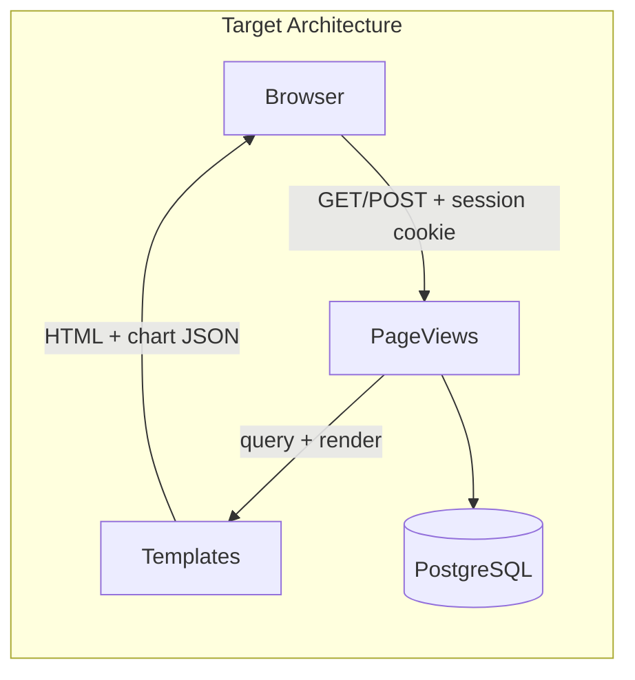

# Server-Rendered Pages Architecture Migration

## Current State

The app is a **client-rendered SPA on Django shells**:

- Pages served via bare `TemplateView` with **no context** ([`urls.py`](urls.py))
- Auth via JWT in `localStorage` + client-side `ensureAuthenticated()` ([`static/shared-layout.js`](static/shared-layout.js))
- All data loaded via `fetch('/api/...')` with Bearer tokens
- No `base.html`, no `pages/views.py`, no Django sessions or CSRF
- Custom `api.models.User` is **not** wired into Django's auth system ([`api/models.py`](api/models.py))



## Target State

Full server-rendered pages with session cookies, server-side data in templates, and form POST for mutations:



**Allowed client JS after migration:** Chart.js rendering (data from server JSON), `AppOverlay.confirm()` for destructive actions, mobile nav toggle. No `localStorage`, no auth bootstrap, no data-fetch loops.

---

## Phase 0: Foundation (prerequisite for all pages)

### 0a. Session + middleware setup — [`settings.py`](settings.py)

Add to `INSTALLED_APPS`: `django.contrib.sessions`, `django.contrib.messages`

Add middleware (order matters):

```python
MIDDLEWARE = [
    'corsheaders.middleware.CorsMiddleware',
    'django.middleware.security.SecurityMiddleware',
    'whitenoise.middleware.WhiteNoiseMiddleware',
    'django.contrib.sessions.middleware.SessionMiddleware',
    'django.middleware.common.CommonMiddleware',
    'django.middleware.csrf.CsrfViewMiddleware',
    'django.contrib.messages.middleware.MessageMiddleware',
]
```

Enable context processors:

```python
'context_processors': [
    'django.template.context_processors.request',
    'django.contrib.messages.context_processors.messages',
    'pages.context_processors.current_user',
    'pages.context_processors.sidebar_links',
]
```

Add session/CSRF settings: `SESSION_COOKIE_HTTPONLY = True`, `CSRF_COOKIE_HTTPONLY = False` (JS needs CSRF cookie only if any fetch remains — for full SSR, forms use ``).

Run `python manage.py migrate` for sessions table.

### 0b. Create `pages/` app

New files:

| File | Purpose |
|------|---------|
| [`pages/auth.py`](pages/auth.py) | Session auth backend, `get_session_user()`, `@login_required`, `@admin_required` decorators |
| [`pages/context_processors.py`](pages/context_processors.py) | Inject `current_user` and `sidebar_links` into every template |
| [`pages/forms.py`](pages/forms.py) | Django forms (login, signup, member, user, job advert, bulk upload) |
| [`pages/views.py`](pages/views.py) | Page view functions |
| [`pages/services.py`](pages/services.py) | Extract shared business logic from [`api/views.py`](api/views.py) (member queries, bulk upload, export, stats computation) |

**Session auth approach** (avoids changing `AUTH_USER_MODEL` / DB schema):

```python
# pages/auth.py
def login_user(request, user):
    request.session['user_id'] = user.id
    request.session.set_expiry(60 * 60 * 24 * 7)  # match current 7-day JWT lifetime

def get_session_user(request):
    uid = request.session.get('user_id')
    if not uid: return None
    try:
        return User.objects.get(pk=uid, status__in=['active', 'pending'])
    except User.DoesNotExist:
        return None

def logout_user(request):
    request.session.flush()
```

Decorators redirect unauthenticated users to `/login?next=...` and attach `request.user` for template/permission checks.

### 0c. Create [`templates/base.html`](templates/base.html)

Extract the shared shell currently built by `renderProtectedPage()` in JS:

- Sidebar with `` and active-state via `active_path`
- Topbar with `{{ current_user.name }}`
- Logout as `<form method="post" action=""></form>`
- Blocks: `title`, `page_title`, `extra_css`, `topbar_actions`, `content`, `extra_js`
- Load [`static/shared-layout.css`](static/shared-layout.css) and slimmed [`static/shared-layout.js`](static/shared-layout.js) (nav toggle + AppOverlay only)

### 0d. Update [`urls.py`](urls.py)

Replace `TemplateView` routes with `pages.views` functions. Keep `/api/` unchanged during migration (tests and backward compat).

---

## Phase 1: Login + Signup

**Simplest starting point** — establishes session auth before any protected page.

### Changes

- [`pages/views.py`](pages/views.py): `login_view`, `signup_view`, `logout_view`
- [`pages/forms.py`](pages/forms.py): `LoginForm` (email or national ID + password — reuse logic from [`api/views.py` `login()`](api/views.py)), `SignupForm` (reuse [`SignupSerializer`](api/serializers.py) validation rules)
- [`templates/login.html`](templates/login.html): Convert to standalone form with `method="post"`, ``, display `{{ form.errors }}` / Django messages — remove fetch + localStorage
- [`templates/signup.html`](templates/signup.html): Same pattern
- Server-side redirect: authenticated users visiting `/login` → `/dashboard`

### Remove from login/signup

- Inline duplicate AppOverlay (keep for errors via Django messages + optional AppOverlay on flash)
- `localStorage.setItem('authToken', ...)`
- Auto-redirect based on token presence

---

## Phase 2: Jobs page

**Simplest protected page** — read-only list, good first SSR protected page.

### Changes

- `jobs_view(request)`: `@login_required`, query job adverts using existing filter logic from [`job_adverts_list()`](api/views.py), pass `job_adverts` to template
- [`templates/jobs.html`](templates/jobs.html): Extend `base.html`, render list with ``, remove all fetch calls
- Delete `renderProtectedPage()` usage from jobs template

---

## Phase 3: Register (data-form)

**Form-heavy page** — member create/update via POST.

### Changes

- `register_view(request)`: Load existing member for current user (if any), handle GET (show form) and POST (create or update)
- `MemberForm` in [`pages/forms.py`](pages/forms.py): Mirror fields from member serializer; county/country selects populated server-side (move static lists from JS into a Python constants module or template context)
- [`templates/data-form.html`](templates/data-form.html): Extend `base.html`, standard Django form rendering, success/error via messages
- Remove: `GET /api/auth/me/`, `GET/POST/PATCH /api/members/` fetch calls

---

## Phase 4: Dashboard

**Most complex page** (~2600 lines) — requires decomposing client logic into server + minimal presentation JS.

### Server-side responsibilities

| Feature | SSR approach |
|---------|-------------|
| KPI cards | Compute counts in `dashboard_view()` from member queryset |
| Charts (status, county, education, etc.) | Aggregate in view, pass as JSON via `{{ chart_data\|safe }}` in `<script>` block |
| Cohort tabs (employed, unemployed, jobs, etc.) | GET query param `?cohort=employed` — view filters queryset |
| Member table filters | GET form submit (`?status=...&county=...&search=...`) |
| Pagination | Django `Paginator` with `?page=N` |
| Member edit | Modal or `/dashboard/members/<id>/edit/` with POST form |
| Member delete | POST form with `AppOverlay.confirm()` then submit |
| Admin export | New page view `export_members_view` — stream zip directly (reuse `_encrypt_and_stream_csv()` from [`api/views.py`](api/views.py), return as file download instead of JSON base64) |
| Jobs cohort tab | When `?cohort=jobs`, include job adverts in context |

### New view structure

```python
@login_required
def dashboard_view(request):
    members = get_members_for_user(request.user)  # from pages/services.py
    cohort = request.GET.get('cohort', '')
    members = apply_cohort_filter(members, cohort)
    members = apply_search_filters(members, request.GET)
    page_obj = Paginator(members, 25).get_page(request.GET.get('page'))
    context = {
        'page_obj': page_obj,
        'kpis': compute_kpis(members),
        'chart_data': json.dumps(compute_chart_data(members)),
        'cohort': cohort,
        'filters': request.GET,
    }
    return render(request, 'dashboard.html', context)
```

### Template refactor

Split [`templates/dashboard.html`](templates/dashboard.html) into:
- `dashboard.html` (extends `base.html`, ~200 lines of markup)
- Optional partials: `templates/dashboard/_kpi_grid.html`, `_member_table.html`, `_charts.html`
- Keep Chart.js init in `` reading server-provided JSON — this is presentation, not data loading

---

## Phase 5: Admin

**Second most complex** — multiple CRUD surfaces, file upload, bulk CSV.

### Server-side mapping

| Current fetch | SSR replacement |
|---------------|-----------------|
| `GET /api/admin/users/` | `admin_view` loads users in context |
| `PATCH /api/admin/users/<id>/` | POST to `/admin/users/<id>/` with form fields |
| `POST /api/admin/users/` | POST create-user form section |
| `GET/POST job adverts` | Forms in admin template |
| `POST file-resources/` + create advert | Single multipart POST form (file + metadata) |
| `DELETE job-adverts/<id>/` | POST with `_method=delete` or dedicated delete URL |
| CSV template download | Link to existing view or new page URL |
| Bulk upload | `<form enctype="multipart/form-data" method="post">` — reuse bulk upload logic from [`admin_members_bulk_upload()`](api/views.py) |

Inline table editing becomes **edit-in-place via row forms** or **dedicated edit pages** — pick row forms to preserve the admin UX without fetch.

User approval/rejection: wire up the existing [`admin_user_approve_reject()`](api/views.py) logic into a page view POST handler (currently unused by frontend).

---

## Phase 6: Cleanup

- Strip auth/data-fetch code from [`static/shared-layout.js`](static/shared-layout.js): remove `ensureAuthenticated`, `loadCurrentUser`, `renderProtectedPage`, `logout()` localStorage logic
- Remove `localStorage.authToken` references from all templates
- Update [`CLAUDE.md`](CLAUDE.md) to reflect SSR architecture
- Add page-level tests in `pages/tests/` (login flow, protected redirect, form submission)
- **Keep `/api/` endpoints** for now (existing pytest suite in `api/tests/` depends on JWT) — document as internal/legacy API; web UI no longer calls them

---

## Shared Logic Extraction

To avoid duplicating business logic between API and page views during migration, extract from [`api/views.py`](api/views.py) into [`pages/services.py`](pages/services.py):

- `get_members_for_user(user)` — role-based queryset
- `compute_dashboard_kpis(members)` / `compute_chart_data(members)`
- `process_bulk_upload(file)` — CSV parsing + validation report
- `create_job_advert_with_file(form_data, uploaded_file)`
- `export_members_csv(user)` / `export_users_csv(user)`

API views become thin wrappers calling services + returning JSON; page views call same services + render templates.

---

## Incremental Rollout Strategy

During migration, **coexistence is safe**:

1. Phase 0–1: Sessions work; old JWT pages still function until individually migrated
2. Each migrated page: remove its fetch calls; unmigrated pages keep JWT temporarily
3. After Phase 6: JWT only used by `/api/` tests, not web UI

Recommended order: **Foundation → Login/Signup → Jobs → Register → Dashboard → Admin → Cleanup**

---

## Key Risks and Mitigations

| Risk | Mitigation |
|------|-----------|
| Dashboard complexity (2600-line template) | Split into partials; migrate chart data first, then table, then filters |
| Custom User model not in Django auth | Custom session key `_user_id` — no schema change needed |
| CSRF on all forms | `` in every form; test with pytest client |
| Export UX change (JSON base64 → file download) | Better UX; update any docs referencing password-in-JSON flow |
| Existing API tests break | Keep API layer untouched; add separate `pages/tests/` |

---

## Files Created/Modified Summary

**New:**
- `pages/` app (auth, views, forms, services, context_processors, tests)
- `templates/base.html`
- `templates/dashboard/_*.html` partials (optional but recommended)

**Modified:**
- [`settings.py`](settings.py) — sessions, middleware, context processors
- [`urls.py`](urls.py) — page routes → view functions
- All page templates — extend `base.html`, server-rendered data
- [`static/shared-layout.js`](static/shared-layout.js) — strip auth/fetch, keep nav + AppOverlay
- [`api/views.py`](api/views.py) — refactor to call shared services (optional during migration, recommended before dashboard)

**Unchanged (initially):**
- [`api/urls.py`](api/urls.py) and JWT auth — kept for test suite
- [`api/models.py`](api/models.py) — no schema changes
- Database migrations — only Django sessions table
